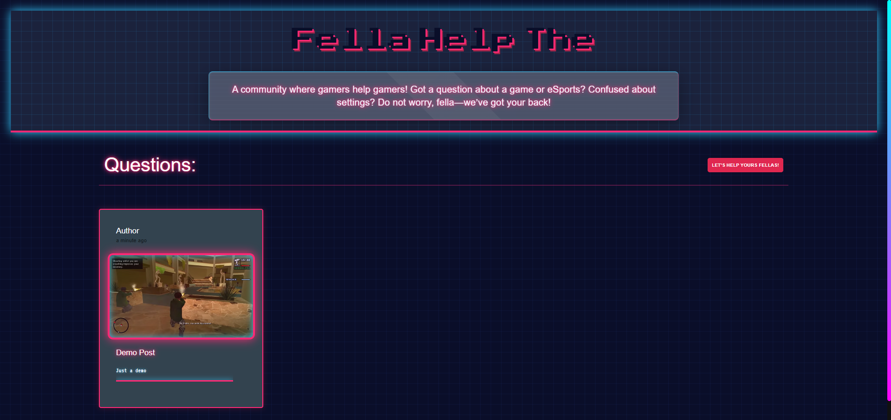

---

```md
# 🎮 Help The Fella

> **A Next.js-powered Q&A platform for gamers, by gamers.** Stuck on a boss? Lost in settings? Diving into eSports? Ask away—your gaming fellas are here to help! 💪

 <!-- Replace with your banner image -->

---

## 🌐 Live Demo

🔗 [Visit Help The Fella](https://your-deployed-link.vercel.app)  
💬 [Join the Community](#) <!-- Replace with discussion link -->

---

## ✨ Features

- ✅ **Ask Questions**: Post your gaming woes to the community.
- ✅ **Browse Answers**: Explore existing questions and solutions.
- ✅ **Sleek UI**: Built with Material UI and custom CSS magic.
- ✅ **Interactive Modal**: Add posts with a smooth "Ask a Question" form.
- ✅ **Real-Time Updates**: Powered by Firebase for instant sync.
- ✅ **Loading States**: Spinner vibes for a polished UX.

---


## 🛠️ Tech Stack

- **[Next.js 13](https://nextjs.org/)** - React framework with SSR & SSG goodness.
- **[Firebase](https://firebase.google.com/)** - Real-time database and auth.
- **[Material UI](https://mui.com/)** - Pre-built components with style.
- **[TypeScript](https://www.typescriptlang.org/)** - Type-safe coding.
- **[CSS Modules](https://github.com/css-modules/css-modules)** - Scoped styling FTW.

---


## 🚀 Getting Started

Ready to jump in? Follow these steps:

1. **Clone the Repo**
   ```bash
   git clone https://github.com/aradhya-7-7/Help-The-Fella.git
   cd Help-The-Fella
   ```

2. **Install Dependencies**
   ```bash
   npm install
   # or
   yarn install
   # or
   pnpm install
   ```

3. **Run the Dev Server**
   ```bash
   npm run dev
   # or
   yarn dev
   # or
   pnpm dev
   ```

4. Open your browser to **[http://localhost:3000](http://localhost:3000)** and start helping fellas!

> **Pro Tip**: Edit `app/page.tsx` to tweak the homepage—changes hot-reload instantly!

---

## 🔑 Environment Setup

To connect to Firebase, create a `.env.local` file in the root and add:

```env
NEXT_PUBLIC_FIREBASE_API_KEY=your_api_key
NEXT_PUBLIC_FIREBASE_AUTH_DOMAIN=your_project.firebaseapp.com
NEXT_PUBLIC_FIREBASE_PROJECT_ID=your_project_id
NEXT_PUBLIC_FIREBASE_STORAGE_BUCKET=your_project.appspot.com
NEXT_PUBLIC_FIREBASE_MESSAGING_SENDER_ID=your_sender_id
NEXT_PUBLIC_FIREBASE_APP_ID=your_app_id
```

> Need help? Check the [Firebase Docs](https://firebase.google.com/docs)!

---

## 🎨 How It Works

- **Homepage (`page.tsx`)**: Fetches posts via `GET /api/posts` and renders them with `PostCard`.
- **Add a Post**: Click **"Let's Help Your Fellas!"** to open the `AddPost` modal.
- **Styling**: Responsive grid layout via `page.module.css` + Material UI flair.

---

## 📚 Learn More

Level up your Next.js skills with these resources:
- **[Next.js Docs](https://nextjs.org/docs)** - Features, APIs, and more.
- **[Learn Next.js](https://nextjs.org/learn)** - Interactive tutorial.
- **[Next.js GitHub](https://github.com/vercel/next.js/)** - Contribute or star it!

This project uses **[next/font](https://nextjs.org/docs/basic-features/font-optimization)** to load **Inter**, a slick Google Font.

---

## 🚀 Deploy on Vercel

Deploy your own instance with ease:
1. Push to GitHub.
2. Connect to [Vercel](https://vercel.com/).
3. Set up your `.env` variables in Vercel’s dashboard.
4. Hit deploy—boom, you’re live!

---

## 👨‍💻 Author

👤 **Aradhya**  
- GitHub: [@aradhya-7-7](https://github.com/aradhya-7-7)  
- Say hi: [your-email@example.com](mailto:your-email@example.com) <!-- Add your email -->

---

## 💪 Support the Project

Love it? Drop a ⭐️ on GitHub! Share it with your gaming crew!

---

## 📜 License

Licensed under the [MIT License](LICENSE). Free to use, fork, and remix!

---

> **"Don’t panic, fella—we’ve got your six!"** 🎮
